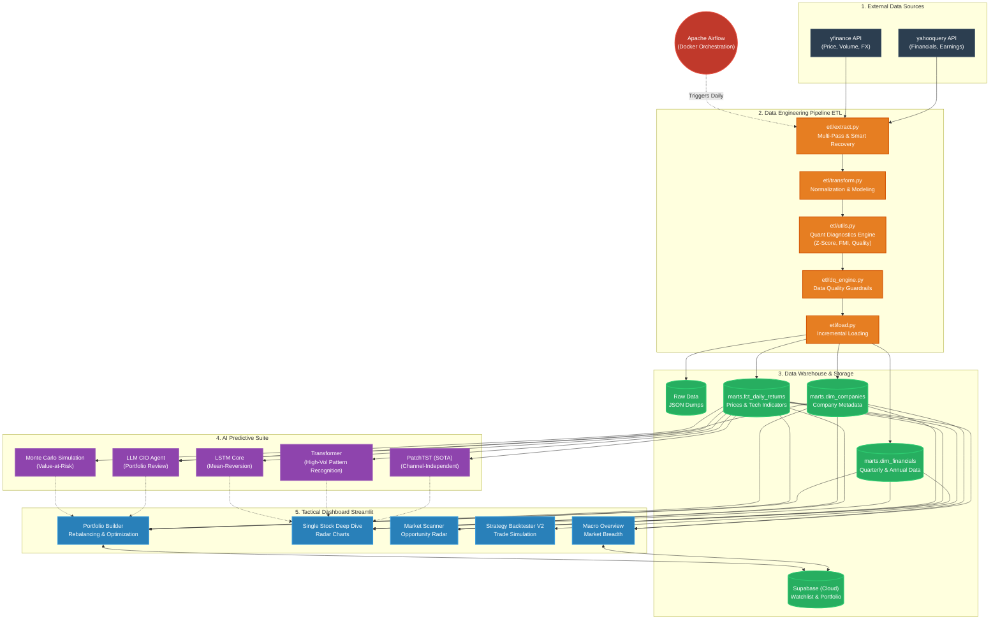

# Honest Quant Intelligence Platform - Knowledge Graph / Architecture

Dưới đây là sơ đồ tri thức (Knowledge Graph) tổng quan về kiến trúc hệ thống, phản ánh chi tiết các Engine AI và Data Pipeline.

### Các cập nhật và thành phần cốt lõi:

1. **AI Predictive Suite (Bộ 3 Mô Hình Forecasting):**
   - **LSTM Core:** Dùng để dự đoán Mean-Reversion.
   - **Transformer:** Nhận diện mẫu đồ thị (Pattern Recognition) trong giai đoạn biến động cao (High-Vol).
   - **PatchTST (SOTA):** Mô hình tối tân phân tích độc lập theo chuỗi thời gian (Channel-Independent) để nhận diện các thay đổi cơ bản.
2. **Data Quality Engine (DQ Engine):** `etl/dq_engine.py` đóng vai trò rào chắn dữ liệu quan trọng giữa khâu tính toán Quant Metrics và khâu ghi vào Data Warehouse.
3. **Database Kép (DuckDB & Supabase):**
   - **DuckDB** lưu trữ toàn bộ dữ liệu thị trường.
   - **Supabase Cloud** được sử dụng để quản lý state của người dùng (Portfolio và Watchlist), đồng bộ hai chiều trực tiếp với Dashboard.
4. **Data Sources & Orchestration**: Điều khiển bởi Airflow, lấy dữ liệu từ `yfinance` và `yahooquery` qua cơ chế *Multi-Pass Extract*.
